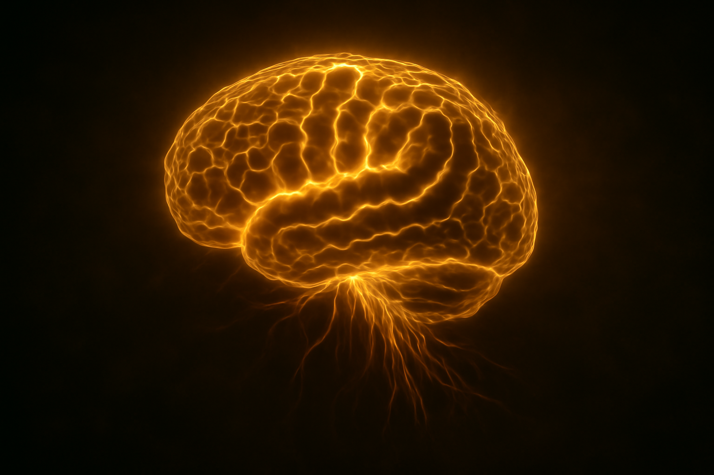
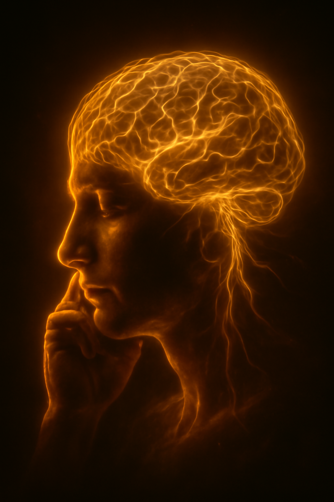

## The Transcendental Mess of Human Thinking

The human brain, a three-pound mass or [1.3 - 1.4] kilograms of soft tissue, which mysteriously generates ideas like jump in nowhere water, concepts in quantum physics, unconventional thoughts, and the puzzling urge to check the refrigerator multiple times, even when we know nothing new will be there or check car keys on the key hanger which you actually kept it just a minute ago. It's a relatable chaos. Yes or No? 🤷‍♂️

## The Thinking Process: A Comedy of Errors

Thinking isn't the clean, linear process we pretend it is. It's like trying to gather a bunch of curious cats while juggling colorful torches on a balancing bike! Our brains:

- Constantly make shortcuts (heuristics)
- Jump to conclusions faster than Olympic long jumpers
- Confidently remember things that never happened

Your subconscious makes most decisions before your conscious mind even arrives at the party. Your brain then creates a compelling story about why you "chose" something, like a lawyer retroactively defending a client they know is guilty. 😄

## Strange But True Brain Facts

- **Energy Consumption**: Your brain consumes 20% of your body's energy despite being only 2% of your weight. It's the ultimate energy vampire.
- **Tip-of-the-Tongue Phenomenon**: This has a scientific name: *lethologica*. It's your brain's way of saying, "I know I know this, but I'm going to torture you instead."
- **Memory Editing**: Your brain edits your memories every time you recall them. They're more like Wikipedia pages, which anyone can edit, rather than photographs.
- **Self-Naming**: The brain named itself. Let that sink in. 😆

## Embracing the Imperfection

Next time your thinking fails you - when you walk into a room and forget why, or spend 20 minutes looking for the glasses on your head - remember you're operating the most complex object in the known universe. It's allowed a few bugs in the system.

But the most wonderful thing about human thinking isn't its perfection, but its beautiful imperfection. The tangled neural pathways, cognitive biases, and random firings in our brains come together to produce:

- Innovation
- Art
- Moments of unexpected clarity that feel magical

It's a testament to the remarkable power of human thought.

## Note

The images used above are AI Generated.
